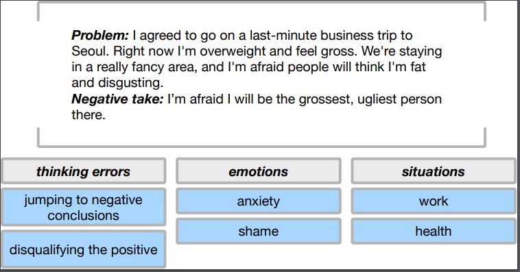

# Natural speech Automated Utility for Mental health (NAUM)
This is the code for EMNLP 2018 paper:  
```
L.M. Rojas-Barahona, B-H Tseng, Y. Dai, C. Mansfield, O. Ramadan, S. Ultes, M. Crawford, M. Gasic. 
Deep learning for language understanding of mental health concepts derived from Cognitive Behavioural
Therapy. EMNLP 2018. Workshop LOUHI.
``` 
It implements 3 deep learning models and 2 non-deep-learning models:


| Classifier | Input Feature | Weighted AVG. F1 score with 1:1 oversampling|
| :---: | :---: | :---: |
| Logistic Regression (LR) | Bag-of-words (BOW) |0.515 +- 0.004|
| Support Vector Machine (SVM) | Bag-of-words (BOW) | 0.550 +- 0.000|
| Fully-connected Neural Network (FNN) | [PVDM](https://arxiv.org/pdf/1405.4053v2.pdf) document embedding|  0.512 +- 0.006 (300 dimension) |
| Gated Recurrent Unit (GRU) | [SkipThought](https://arxiv.org/abs/1506.06726) sentence embedding|  0.560 +- 0.004 (300 dimension) |
| Convolutional Neural Network (CNN) | [GloVe](https://nlp.stanford.edu/projects/glove/) word embedding| 0.598 +- 0.010 (300 dimension) |

All the deep learning models and non-deep-learning models
are trained and evaluated on NAUM data.

## Data
The corpus is dialog data of Cognitive Behavioural Therapy (CBT) domain. It consists of 500K written posts that users 
anonymously posted on the [Koko platform](https://itskoko.com/).
There are only 5056 posts have been labelled by professional pychologists. 
An example of an annotated Koko post is below.



In the ontology of CBT, there are 3 supercategories : __emotions__, __thinking errors__ and  __situations__. Each of them has
multiple subcategories. The follwing dictionary shows the CBT ontology. More examples and details can be found in our paper.
```angular2html
{
  "emotions": [
    "Anxiety",
    "Depression",
    "Hurt",
    "Anger",
    "Loneliness",
    "Grief",
    "Shame",
    "Jealousy",
    "Guilt"
  ],
  "thinking_errors": [
    "Jumping_to_negative_conclusions",
    "Fortune_telling",
    "Black_and_white",
    "Low_frustration_tolerance",
    "Catastrophising",
    "Mind-reading",
    "Labelling",
    "Emotional_reasoning",
    "Over-generalising",
    "Inflexibility",
    "Blaming",
    "Disqualifying_the_positive",
    "Mental_filtering",
    "Personalising",
    "Comparing"
  ],
  "situations": [
    "Relationships",
    "Existential",
    "Health",
    "School_College",
    "Other",
    "Work",
    "Bereavement"
  ]
}
```
NAUM data is currently not published, for more information please contact
Dr. Gasic {_mg436@cam.ac.uk_}

## Requirements
* Tensorflow-gpu 1.8
* NLTK 3.3
* Gensim 3.4.0
* Scikit-learn  0.19.1  

My environment is Ubantu 16.04 and python 3.6, others have not been tested yet  and the program may fail
 due to inconsistency.

## Usage
Before starting, please take a look at _config.ini_ file, it contains all the hyperparameters
for model training. You can adjust them as you need.


__1. Preprocess raw data__.

We need to clean the raw data and preprocess them into readable files.  
Using commands:  
``` 
$ cd NAUM
$ python run.py --parsing=unlabelled_data
```
It will build the word vocabulary and the following files: 
 * training_data_for_GloVe.txt
 * training_data_for_SkipThought.json
 * training_data_for_PVDM.json

 
And then by using:
```
$ python run.py --parsing=labelled_data
```
we can  get the cleaned labelled data file:
 * NAUM_labelled_data.json

All the data files are saved automatically in  `NAUM/Data/` dir. All the intermediate results and models generated in the following steps will be saved in the 	`save_dir` set in the `config.ini` file.

__2. Training embedding models__

 GloVe model is for word embeddings training.   
 SkipThought model is for sentence embeddings training.   
 PVDM model is for document embeddings training.

You could use the following commands:
```
$ python run.py --model=GloVe --vector_size=300   --mode=training 
$ python run.py --model=SkipThought --vector_size=300 --mode=training 
$ python run.py --model=PVDM --vector_size=300 --mode=training 
```
`vector size`(default 100) means word embedding size, sentence embedding size and 
document embedding size for GloVe, SkipThought and PVDM respectively. In our paper, we set it as 100 and 300, but you can 
change it as any dimension as you want.   
After training, GloVe model will output a vocabulary file of word vectors , e.g.`GloVe_vectors_300d.pkl`.
  SkipThought model will output a dir containing tensorflow ckpt model, e.g. `SkipThoughtModel_300d` 
  PVDM model will automatically save the model somewhere by [gensim](https://radimrehurek.com/gensim/models/doc2vec.html).
  
__3. Transforming posts into embeddings__

After training the embeddings, SkipThought and PVDM embeddings
need to be used to transform labelled posts into distributed representation 
before training classifier. For GloVe, in order to save the memory, labelled posts are transformed at the 
same time of training classifier by looking up GloVe word vectors.  
By these commands:
```
$ python run.py --model=SkipThought --vector_size=300 --mode=testing
$ python run.py --model=PVDM  --vector_size=100 --mode=testing
```
You could get following training data files for GRU-SkipThought and FNN-PVDM respectively
 * data_sentence_embedded_300d.pkl
 * data_document_embedded_100d.pkl

Input `$ python run.py --model=CNN --vector_size=300 --mode=testing`, however,  will give you a picture of T-SNE visulization
 to see how your word vectors are distributed.

You can also generate a story by inputing the first sentence into Skip-thought models. 
The follwing sentences are generated through random sampling.
```
$ python run.py --model=SkipThought --vector_size=300 --mode=generating
```

__4. Training classifier models__

In this code, CNNs take GloVe word embeddings as input,
GRUs take SkipThought sentence embeddings as input and FNNs take PVDM doc embeddings.
You have to revise the code if you want to try different combinations.
Two non-deep-learning baselines are logistic regression and SVM. 


In our experiments, we use 10-fold cross validation and 5 seeds(multiple independent experiments) for each label(subcategory).
The command is like follows: 
```
$ python run.py --model=CNN_GloVe  --vector_size=300 --mode=training --seed=1 --label=Anxiety --round_id=1 --oversampling_ratio=1
```
where `model` can take `CNN_GloVe`,`GRU_SkipThought`,`FNN_PVDM`,`LR_BOW`,`SVM_BOW` five values.
`seed` takes postive int number , indicating the `seed` _th_ independent experiment.
`round_id` can take int number [1,10], indicating the `round_id` _th_ cross validation. 
`oversampling_ratio` takes 0,1,3,5,7, indicating no oversampling, oversampling ratio 1:1,
1:3, 1:5 and 1:7. As for `label`, please use the same name for all values given in the _CBT_ontology.json_ file,
e.g. 'Anger', 'Black_and_white', 'Over-generalising', etc.

By running the command above, the test F1 scores are acquired by early stopping mechanism and all intermediate
metric results are output into a txt file, such as
 `CNN_GloVe_300d_Results/seed1/Anxiety/oversampling_ratio1/round1/results.txt` .  
The same for other deep learning models, for example, input command
```
$ python run.py --model=GRU_SkipThought  --vector_size=100 --mode=training --seed=2 --label=Blaming --round_id=3 --oversampling_ratio=0
```
can get you  `GRU_SkipThought_100d_Results/seed2/Blaming/oversampling_ratio0/round3/results.txt` .  
For non-deep-learning models, you don't need to input the `vector_size`.


__5. Evaluating classifier models__

For one classifier model with a certain `vector_size`, after getting its complete results of all seeds, all subcategories, 10 cross validations, 5 oversampling ratios (that's 5\*31\*10\*5=7750 files in our experiment). You could evaluate final results using the command like:

```angular2html
$ python run.py --model=CNN_GloVe --vector_size=100 --mode=evaluating
```
This will automatically  generate an excel file recording all metrics (precision, recall, F1, accuracy, TP, TN, FP, FN) and a json file recording the predictions of
labelled data for `CNN_GloVe_100d_Results`. 

Final F1 scores reported in paper are calculated by averaging 10-fold cross validation results, and then to get the mean and variance 
by 5 seeds . Final predictions for each labelled data are calculated by majority voting (we only use oversampling ratio 1:1 results to predict). 

___Note: If you find any bugs, please contact dyp16@mails.tsinghua.edu.cn. Thank you !___


